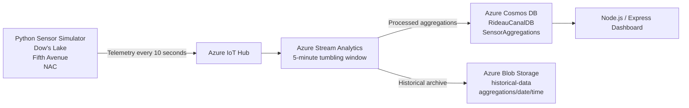

# cst8916-final-project
# Rideau Canal Skateway Monitoring System

## Student Information
- Name: Khalid Amchat
- Course: CST8916 - Remote Data and Real-time Applications
- Assignment: Final Project
- Term: Winter 2026

## Project Overview
This project is a real-time monitoring system for the Rideau Canal Skateway. It simulates environmental sensor data from three locations: Dow’s Lake, Fifth Avenue, and NAC. The system sends telemetry data to Azure IoT Hub, processes it using Azure Stream Analytics, stores processed data in Azure Cosmos DB, archives data in Azure Blob Storage, and displays the results in a web dashboard.

## Architecture
The solution uses the following pipeline:

Sensor Simulator → Azure IoT Hub → Azure Stream Analytics → Cosmos DB + Blob Storage → Node.js Dashboard



## Azure Services Used
- Azure IoT Hub
- Azure Stream Analytics
- Azure Cosmos DB
- Azure Blob Storage
- Azure App Service

## Locations Monitored
- Dow’s Lake
- Fifth Avenue
- NAC

## Data Collected
Each simulated sensor reading includes:
- deviceId
- location
- timestamp
- iceThicknessCm
- surfaceTempC
- snowAccumulationCm
- externalTempC

## Stream Analytics Processing
The Stream Analytics job uses a 5-minute tumbling window to calculate:
- average ice thickness
- minimum ice thickness
- maximum ice thickness
- average surface temperature
- minimum surface temperature
- maximum surface temperature
- maximum snow accumulation
- average external temperature
- reading count
- safety status

## Safety Rules
- Safe: ice thickness ≥ 30 cm and surface temperature ≤ -2°C
- Caution: ice thickness ≥ 25 cm and surface temperature ≤ 0°C
- Unsafe: all other cases

## Cosmos DB Configuration
- Account: cst8916-rideau-cosmos
- Database: RideauCanalDB
- Container: SensorAggregations
- Partition key: /location

## Blob Storage Configuration
- Storage account: cst8916rideaustorage
- Container: historical-data
- Path pattern: aggregations/{date}/{time}

## Dashboard Features
- overall system status
- live location status cards
- auto-refresh
- historical charts for the last hour

## Repository Structure
This project is organized into three repositories:
1. Main documentation repository
2. Sensor simulation repository
3. Dashboard repository

## Screenshots
The required screenshots are included in the `screenshots` folder:
- IoT Hub devices
- IoT Hub metrics
- Stream Analytics query
- Stream Analytics running
- Cosmos DB data
- Blob Storage data
- Dashboard local
- Dashboard Azure

## Demo Video
A demo video is included and linked in `LINKS.md`.

## Challenges and Solutions
### Challenge 1
At first, Azure Stream Analytics was not receiving data from IoT Hub.

### Solution
The issue was related to configuration and validation. After correcting the setup and confirming the input with query test results, the Stream Analytics job started processing the incoming data correctly.

### Challenge 2
The Blob output was initially writing files directly to the container root.

### Solution
The Blob output path pattern was updated to:
`aggregations/{date}/{time}`

### Challenge 3
The Cosmos DB documents originally had inconsistent ID behavior.

### Solution
The query and Cosmos output configuration were updated so that the generated field uses `id` consistently.

## How to Run the Project
### 1. Run the sensor simulator
Go to the sensor simulation repository and run:

```bash
pip install -r requirements.txt
python sensor_simulator.py
```
### 2. Start Azure services
Make sure IoT Hub, Stream Analytics, Cosmos DB, and Blob Storage are configured and running.

### 3. Run the dashboard locally
Go to the dashboard repository and run:
```bash
npm install
node server.js
```
Then open: http://localhost:3000

## AI Usage Disclosure
This project used AI tools for guidance, debugging assistance, explanation, and documentation support. All code, configuration, testing, and final validation were reviewed and adjusted.
