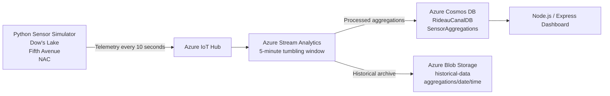

# cst8916-final-project
# Rideau Canal Skateway Monitoring System
---
## 1- Student Information
- Name: Khalid Amchat
- Student ID: 041125350
- Course: CST8916 - Remote Data and Real-time Applications
- Assignment: Final Project
- Term: Winter 2026
---
## 2- Project Overview
This project is a real-time monitoring system for the Rideau Canal Skateway. It simulates environmental sensor data from three locations — **Dow's Lake**, **Fifth Avenue**, and **NAC** — and sends the data to Azure for ingestion, processing, storage, and visualization.

The system uses a Python sensor simulator, Azure IoT Hub, Azure Stream Analytics, Azure Cosmos DB, Azure Blob Storage, and a Node.js web dashboard deployed on Azure App Service. The goal is to monitor skateway conditions such as ice thickness, surface temperature, snow accumulation, and external temperature, then display live safety information and historical trends.

---
## 3- Scenario Overview

### Problem Statement
The Rideau Canal Skateway requires monitoring of environmental conditions to help determine whether the ice is safe for public use. In a real-world scenario, sensors could be placed at key locations to continuously report conditions such as ice thickness and temperature. A cloud-based monitoring system can process this data in real time and provide live visibility into safety conditions.

### System Objectives
The main objectives of this project are:
- Simulate IoT sensor data for three Rideau Canal locations
- Send telemetry to Azure IoT Hub
- Process the incoming data using Azure Stream Analytics
- Store processed results in Azure Cosmos DB
- Archive processed records in Azure Blob Storage
- Display live safety information and historical charts in a web dashboard
- Deploy the dashboard to Azure App Service

---
## 4- System Architecture

### Architecture Diagram

### Data Flow Explanation
The system follows this data flow:

**Python Sensor Simulator → Azure IoT Hub → Azure Stream Analytics → Azure Cosmos DB + Azure Blob Storage → Node.js Dashboard → Azure App Service**

1. The Python sensor simulator generates telemetry every 10 seconds for:
   - Dow's Lake
   - Fifth Avenue
   - NAC

2. Azure IoT Hub receives the telemetry messages from the virtual devices.

3. Azure Stream Analytics reads the incoming stream and processes the data using a **5-minute tumbling window**.

4. The processed results are sent to:
   - **Azure Cosmos DB** for live dashboard queries
   - **Azure Blob Storage** for historical JSON file archiving

5. The Node.js dashboard reads processed data from Cosmos DB and displays:
   - overall system status
   - live location cards
   - historical trend charts

6. The dashboard is deployed on **Azure App Service**.

### Azure Services Used
- Azure IoT Hub
- Azure Stream Analytics
- Azure Cosmos DB
- Azure Blob Storage
- Azure App Service
---

## 5- Implementation Overview
### 1. IoT Sensor Simulation
The sensor simulation component is implemented in Python and is stored in the sensor simulation repository.

**Repository link:** [https://github.com/CST8916-Final-Project/rideau-canal-sensor-simulation]

The simulator:
- creates three virtual devices
- sends telemetry every 10 seconds
- generates readings for:
  - `deviceId`
  - `location`
  - `timestamp`
  - `iceThicknessCm`
  - `surfaceTempC`
  - `snowAccumulationCm`
  - `externalTempC`

### 2. Azure IoT Hub Configuration
Azure IoT Hub is used as the ingestion layer for the sensor telemetry.

Configured devices:
- `dows-lake`
- `fifth-avenue`
- `nac`

IoT Hub receives the telemetry sent by the Python simulator and provides the input source for the Stream Analytics job.

### 3. Stream Analytics Job
Azure Stream Analytics processes the incoming telemetry stream using a **5-minute tumbling window** grouped by location.

It calculates:
- average, minimum, and maximum ice thickness
- average, minimum, and maximum surface temperature
- maximum snow accumulation
- average external temperature
- reading count
- safety status

The final query is stored in:
- [`query.sql`](stream-analytics/query.sql)

### 4. Cosmos DB Setup
Azure Cosmos DB is used to store the processed aggregation results for dashboard queries.

Configuration:
- **Database:** `RideauCanalDB`
- **Container:** `SensorAggregations`
- **Partition key:** `/location`
- **Document ID format:** `{location}-{timestamp}` stored in the Cosmos DB `id` field

### 5. Blob Storage Configuration
Azure Blob Storage is used to archive processed data in JSON format.

Configuration:
- **Storage container:** `historical-data`
- **Path pattern:** `aggregations/{date}/{time}`

This allows the system to keep historical output files organized by date and time.

### 6. Web Dashboard
The web dashboard is built with Node.js, Express, HTML, CSS, JavaScript, and Chart.js.

**Repository link:** [(https://github.com/KhalidAlgonquin/rideau-canal-dashboard)]

Main features:
- overall system status
- live location status cards
- historical charts for the last hour
- automatic refresh every 30 seconds

### 7. Azure App Service Deployment
The dashboard is deployed to Azure App Service.

Deployment summary:
- runtime: Node.js
- application settings configured for Cosmos DB connection
- dashboard accessible through Azure Web App URL

---

## 6- Repository Structure
This project is organized into three repositories:
1. [`Main documentation repository`](https://github.com/CST8916-Final-Project/cst8916-final-project)
2. [`Sensor simulation repository`](https://github.com/CST8916-Final-Project/rideau-canal-sensor-simulation)
3. [`Dashboard repository`](https://github.com/KhalidAlgonquin/rideau-canal-dashboard)
---
## 7- Demo Video
[`Watch demo video`](https://www.youtube.com/watch?v=d7CRK4UIug8) 

---
## 8-Setup Instructions

### Prerequisites
Before running the project, make sure you have:
- Python 3 installed
- Node.js and npm installed
- Azure subscription
- Configured Azure resources:
  - IoT Hub
  - Stream Analytics job
  - Cosmos DB
  - Blob Storage
  - App Service
- Valid connection strings and environment variables

### High-Level Setup Steps
1. Clone the three repositories.
2. Configure the sensor simulator `.env` file with the IoT Hub device connection strings.
3. Run the sensor simulator.
4. Start the Azure Stream Analytics job.
5. Verify that IoT Hub, Cosmos DB, and Blob Storage are receiving data.
6. Configure the dashboard `.env` file with Cosmos DB connection values.
7. Run the dashboard locally or deploy it to Azure App Service.

### Links to Detailed Setup
- **Sensor setup details:** [https://github.com/CST8916-Final-Project/rideau-canal-sensor-simulation]
- **Dashboard setup details:** [https://github.com/KhalidAlgonquin/rideau-canal-dashboard]
---

## 9- Results and Analysis

### Sample Outputs and Screenshots
Sample outputs and screenshots are included in the [`screenshots`](screenshots/) folder, such as:

### Data Analysis
The system successfully processes telemetry from three simulated locations and calculates aggregated condition metrics every 5 minutes. The dashboard displays these metrics and derives a safety status for each location.

### System Performance Observations
- The simulator sends data every 10 seconds.
- Azure Stream Analytics aggregates the incoming data in 5-minute windows.
- The dashboard refreshes every 30 seconds.
- Historical charts become more informative as more aggregation windows are stored over time.

---
## 10- Challenges and Solutions

### Challenge 1
At first, Azure Stream Analytics was not receiving data from IoT Hub.

### Solution
The issue was related to configuration and validation. After correcting the setup and confirming the input with query test results, the Stream Analytics job started processing the incoming data correctly.

### Challenge 2
The Blob output was initially writing files directly to the container root.

### Solution
The Blob output path pattern was updated to:
`aggregations/{date}/{time}`

### Challenge 3
The Cosmos DB documents originally had inconsistent ID behavior.

### Solution
The query and Cosmos output configuration were updated so that the generated field uses `id` consistently.

---
## 11- AI Usage Disclosure
This project used AI tools to support:
- debugging assistance
- code structure suggestions
- documentation drafting

### Tools Used
- ChatGPT
---
## 12- References

### Libraries Used
- Azure IoT Device SDK for Python
- python-dotenv
- Express.js
- Azure Cosmos DB SDK for Node.js
- Chart.js
