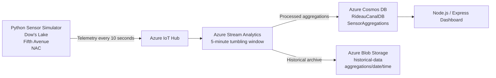

## Architecture Diagram

```mermaid
flowchart LR
    A[Python Sensor Simulator<br/>Dow's Lake<br/>Fifth Avenue<br/>NAC] -->|Telemetry every 10 seconds| B[Azure IoT Hub]

    B --> C[Azure Stream Analytics<br/>5-minute tumbling window]

    C -->|Processed aggregations| D[Azure Cosmos DB<br/>RideauCanalDB<br/>SensorAggregations]
    C -->|Historical archive| E[Azure Blob Storage<br/>historical-data<br/>aggregations/date/time]

    D --> F[Node.js / Express Dashboard]
```
